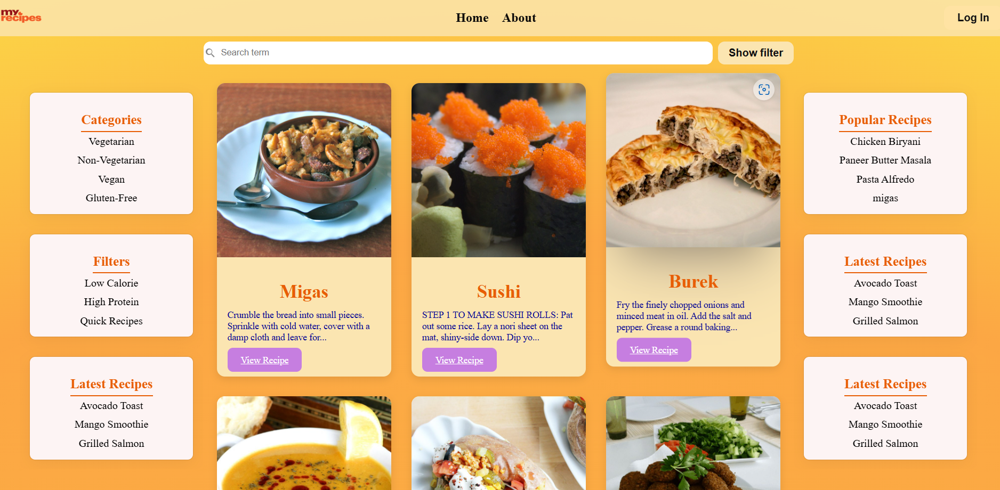

#  Recipe  App  

A **React + Firebase** recipe  app where users can **browse, add, and manage recipes**. The app includes **Firebase Authentication** for user login and a **Firestore Database** for storing recipe details.  

---

## 🚀 Features  

✅ **User Authentication** (Sign Up, Login, Logout using Firebase Auth)  
✅ **CRUD Functionality** (Create, Read, Update, Delete Recipes in Firestore)  
✅ **Store Recipes in Firebase Firestore**  
✅ **Authentication-based Access Control** (Users can only edit their own recipes)  
✅ **Firebase Hosting Deployment**  
✅ **Mobile-Friendly Responsive UI**  

---

## 🛠️ Tech Stack  

- **Frontend**: React (Vite)  
- **State Management**: Context API  
- **Database**: Firebase Firestore (NoSQL)  
- **Authentication**: Firebase Authentication  
- **Hosting**: Firebase Hosting  
- **Styling**: CSS  

---

## 📸 Screenshots  

### 📌 Home Page  


---

## 🔥 Live Demo  

🔗 **[View Live App](https://recipe-app-green-omega.vercel.app/)**  

---

## 📦 Installation & Setup  

### Clone the Repository  
```sh
git clone https://github.com/Skiee9/Recipe-App.git
cd recipe-app
npm install

### Create .env.local
VITE_FIREBASE_API_KEY=your-api-key
VITE_FIREBASE_AUTH_DOMAIN=your-auth-domain
VITE_FIREBASE_PROJECT_ID=your-project-id
VITE_FIREBASE_STORAGE_BUCKET=your-storage-bucket
VITE_FIREBASE_MESSAGING_SENDER_ID=your-messaging-sender-id
VITE_FIREBASE_APP_ID=your-app-id

### Run
npm run dev

### Firebase deployment
npm run build
firebase login
firebase init
firebase deploy
